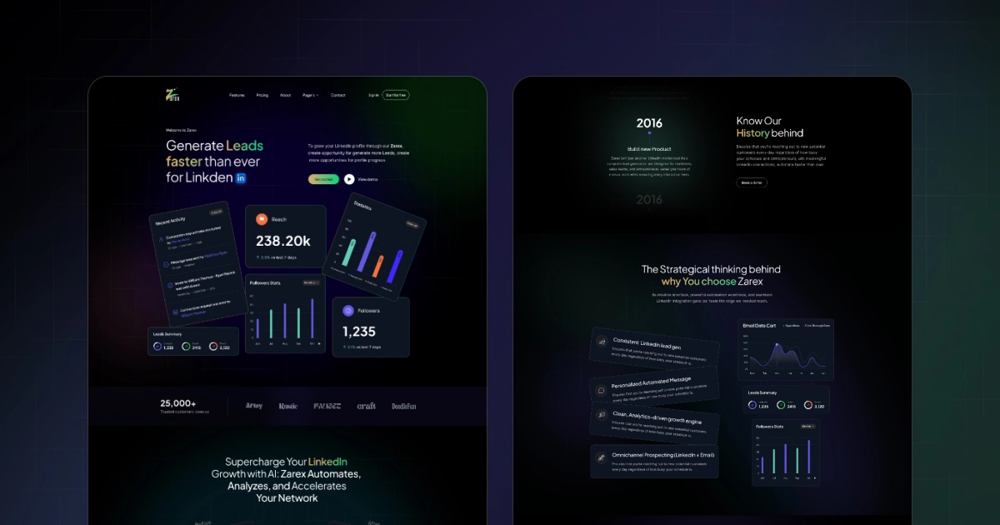

<p align="center">
  
</p>

<h1 align="center">Zarex - Astro Website Template</h1>

<p align="center">
  Astro website template with data-driven sections, blog content collections, and animation tooling for modern SaaS sites.
</p>

<p align="center">
  <a href="#features">Features</a> |
  <a href="#pages">Pages</a> |
  <a href="#getting-started">Getting Started</a> |
  <a href="#customization">Customization</a> |
  <a href="#project-structure">Project Structure</a> |
  <a href="#license">License</a>
</p>

<p align="center">
  
</p>

---

## Features
- Astro 5 with Tailwind CSS 4 configured via `@tailwindcss/vite`.
- GSAP + ScrollTrigger animations with Lenis smooth scrolling in `src/scripts/base-layout.js`.
- Lottie icon animations powered by `public/vendor/lottie.min.js` and `public/scripts/wcu-lottie.js`.
- Data-driven page content in `src/data/*.ts`.
- Blog content collection with RSS feed at `/rss.xml`.
- SEO metadata, Open Graph/Twitter cards, and JSON-LD in `src/layouts/BaseLayout.astro`.
- Sitemap integration configured in `astro.config.mjs`.
- Reusable section and UI components in `src/components/sections` and `src/components/ui`.

---

## Recent Project Updates

### 🚀 Performance & Cleanup
- **Component Optimization**: Removed unused components (`AboutFaqSection`, `AboutTestimonialsSectionV2`, `PricingTestimonialsSection`) to streamline the build process.
- **Asset Management**: Cleaned up redundant image assets to reduce project size.
- **GSAP Refinement**: Optimized `src/scripts/base-layout.js` by removing deprecated animation triggers and improving scroll performance.

### 📱 Responsive Layout Enhancements
- **Testimonials Slider**: Implemented a centered 90% width carousel for mobile devices with smooth color transitions for the active state.
- **Hero Section**: Adjusted decorative shapes for better visibility and layout on mobile devices (including size and position fixes for screens under 768px).
- **Growth Section**: Optimized title block widths and spacing for large screens (up to 1440px+) and mobile views.

---

## Pages

### Main
| Route | File |
| --- | --- |
| `/` | `src/pages/index.astro` |
| `/home-two` | `src/pages/home-two.astro` |
| `/features` | `src/pages/features.astro` |
| `/about-us` | `src/pages/about-us.astro` |
| `/contact-us` | `src/pages/contact-us.astro` |
| `/pricing-plan` | `src/pages/pricing-plan.astro` |

### Blog
| Route | File |
| --- | --- |
| `/blog` | `src/pages/blog/index.astro` |
| `/blog/[slug]` | `src/pages/blog/[slug].astro` |
| `/blog/author/[author]` | `src/pages/blog/author/[author].astro` |
| `/blog/category/[category]` | `src/pages/blog/category/[category].astro` |
| `/rss.xml` | `src/pages/rss.xml.js` |

### Integrations
| Route | File |
| --- | --- |
| `/integration` | `src/pages/integration/index.astro` |
| `/integration/[slug]` | `src/pages/integration/[slug].astro` |

### Authentication
| Route | File |
| --- | --- |
| `/authentication/sign-in` | `src/pages/authentication/sign-in.astro` |
| `/authentication/sign-up` | `src/pages/authentication/sign-up.astro` |

### Template Info
| Route | File |
| --- | --- |
| `/template-info/style-guide` | `src/pages/template-info/style-guide.astro` |
| `/template-info/licenses` | `src/pages/template-info/licenses.astro` |
| `/template-info/changelog` | `src/pages/template-info/changelog.astro` |
| `/template-info/instruction` | `src/pages/template-info/instruction.astro` |

### Utility
| Route | File |
| --- | --- |
| `/401` | `src/pages/401.astro` |
| `/404` | `src/pages/404.astro` |

---

## Getting Started

### Prerequisites
- Node.js >= 18.17.1
- npm, yarn, or pnpm

### Install
```bash
npm install
# or
yarn install
# or
pnpm install
```

### Development
```bash
npm run dev
```

### Build
```bash
npm run build
```

### Preview
```bash
npm run preview
```

---

## Customization

### Site URL and SEO Defaults
- Update the production domain in `astro.config.mjs`.
- Update defaults like `SITE_NAME`, `SITE_URL`, and `TWITTER_HANDLE` in `src/layouts/BaseLayout.astro`.

### Colors and Typography
- CSS custom properties live in `src/styles/global.css`.
- Tailwind theme tokens live in `tailwind.config.mjs`.

### Page Content Data
Edit the data files in `src/data`:
- `src/data/home.ts`
- `src/data/home-two.ts`
- `src/data/about-us.ts`
- `src/data/features.ts`
- `src/data/pricing-plan.ts`
- `src/data/contact-us.ts`
- `src/data/integration.ts`

### Blog Content
Blog entries live in `src/content/blog`. The schema is defined in `src/content/config.ts`.

Example frontmatter:
```markdown
---
title: "Post title"
summary: "Short summary"
author: "Author name"
date: 2026-01-17
image: "/images/blog-bg.png"
category: "Category"
---
```

### Images, Video, and Lottie
- Images: `src/assets/images`
- Videos: `public/videos`
- Lottie JSON files: `public/documents`
- Lottie runtime: `public/vendor/lottie.min.js`
- Lottie init script: `public/scripts/wcu-lottie.js`

---

## Project Structure

```
public/
  documents/          # Lottie JSON data
  scripts/            # Lottie helper + vendor script copies
  vendor/             # Lottie runtime
  videos/
  favicon.svg
  robots.txt
  webclip.svg
src/
  assets/
    images/
  components/
    sections/
    ui/
  content/
    blog/
    config.ts
  data/
  layouts/
  pages/
  scripts/
  styles/
  utils/
astro.config.mjs
package.json
tailwind.config.mjs
tsconfig.json
```

---

## Tech Stack

| Dependency | Version | Purpose |
| --- | --- | --- |
| Astro | ^5.16.11 | Static site framework |
| Tailwind CSS | ^4.1.18 | Styling |
| TypeScript | ^5.9.3 | Type safety |
| GSAP | ^3.14.2 | Animations |
| Lenis | ^1.3.17 | Smooth scroll |
| Lottie Web | ^5.13.0 | Animated icons |
| @astrojs/mdx | ^4.3.13 | MDX support |
| @astrojs/rss | ^4.0.15 | RSS feed |
| @astrojs/sitemap | ^3.7.0 | Sitemap |

---

## Available Scripts

| Command | Description |
| --- | --- |
| `npm run dev` | Start the development server |
| `npm run build` | Build the production site |
| `npm run preview` | Preview the production build |
| `npm run astro` | Run Astro CLI commands |

---

## License
This project is released under a commercial license. See `LICENSE`.
